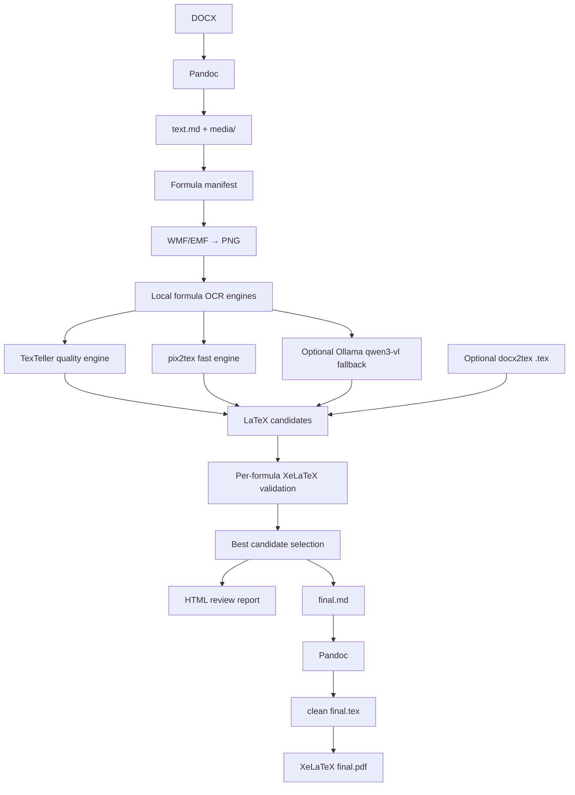

# dotex — DOCX → XeLaTeX for old mathematical papers

<p align="center">
  <b>Local-first pipeline for converting legacy mathematical DOCX papers with WMF/OLE formulas into clean Markdown, LaTeX formulas and XeLaTeX/PDF.</b>
</p>

<p align="center">
  
  
  
  
  
</p>

---

## What is this?

`dotex` / `docx2xelatex` is a local, controllable conversion pipeline for old scientific DOCX documents, especially mathematical papers where formulas are stored as legacy **WMF/OLE MathType / Equation Editor objects**.

The goal is not just “convert DOCX to PDF”. The goal is to recover a real, editable, modern XeLaTeX document:

```text
old DOCX → clean Markdown → recognized LaTeX formulas → final.md → final.tex → final.pdf
```

The project is designed for documents like old Russian-language mathematical papers, where the text is still readable by Pandoc, but formulas are embedded as images such as:

```markdown

```

Instead of trusting one magic converter, `dotex` treats every formula as a separate recoverable object.

---

## Why I created this

I had several old mathematical scientific papers written in DOCX. They contain a lot of formulas, but most of them are not modern Word OMML equations. They are old embedded objects with WMF previews.

I tried different tools and workflows:

* Pandoc
* MarkItDown
* MinerU
* Nougat
* PDF-based extraction
* DOCX → PDF → OCR approaches
* direct DOCX → LaTeX converters

They all helped in some places, but none of them gave a clean, reliable XeLaTeX result for this exact case.

Typical problems were:

* formulas became images instead of LaTeX;
* old WMF/OLE formulas were not recovered;
* generated `.tex` was too dirty to maintain;
* XeLaTeX compilation failed on broken formulas;
* formatting, italics and structure were partially lost;
* one bad formula could break the whole document.

So I built this project around a different idea:

> Use Pandoc for what it is good at — text and document structure.
> Use specialized local OCR models for what they are good at — formula recognition.
> Validate every formula independently.
> Never let one broken formula destroy the whole paper.

---

## Core idea

Each formula goes through its own lifecycle:

```text
image → png → candidates → validation → selection → merge
```

If a formula cannot be recognized or compiled, the final document is still generated with a PNG preview and a `TODO_FORMULA_f0001` marker, so it can be fixed manually later.

Legacy WMF/EMF formula images are not allowed into `final.md` / `final.tex`.

This makes the pipeline practical for real archival work.

---

## How it works



### What each tool does

| Component                | Role                                                                     |
| ------------------------ | ------------------------------------------------------------------------ |
| **Pandoc**               | Extracts text, paragraphs, lists, italics, bold text and media from DOCX |
| **ImageMagick**          | Converts WMF/EMF formula previews into PNG                               |
| **pix2tex**              | Fast local formula OCR engine                                            |
| **TexTeller**            | Higher-quality formula OCR engine, useful for harder formulas            |
| **Ollama + qwen3-vl:8b** | Optional local vision fallback                                           |
| **XeLaTeX**              | Validates every candidate formula and builds final PDF                   |
| **docx2tex**             | Optional additional formula candidate source, not final TeX generator    |

---

## Why not use final `.tex` from docx2tex?

`docx2tex` can sometimes extract useful math from old OLE/MathType formulas, but its full generated `.tex` can be unstable and hard to maintain.

In this project, `docx2tex` is treated as an optional formula source only:

```text
docx2tex output → extract formula candidates → validate → maybe use
```

The final document is rebuilt cleanly:

```text
Pandoc Markdown → final.md → clean final.tex → XeLaTeX
```

---

## Privacy model

`dotex` is designed for confidential documents.

* Your DOCX files are processed locally.
* Formula images are processed locally.
* Default OCR engines run locally in your Python environment.
* Optional Ollama fallback uses local Ollama at `http://localhost:11434`.
* The project intentionally rejects non-localhost Ollama URLs.
* No document text, formulas or images are sent to external APIs.

Internet access is only needed when you install dependencies yourself.

---

## Requirements

Install these tools locally:

| Tool               | Purpose                              |
| ------------------ | ------------------------------------ |
| Python 3.11+       | Main project runtime                 |
| Pandoc             | DOCX → Markdown and Markdown → LaTeX |
| MiKTeX or TeX Live | XeLaTeX compilation                  |
| ImageMagick        | WMF/EMF → PNG                        |
| pix2tex            | Fast local formula OCR               |
| TexTeller          | Higher-quality local formula OCR     |
| Ollama             | Optional fallback vision runtime     |
| `qwen3-vl:8b`      | Optional fallback vision model       |

---

## Russian XeLaTeX preset

By default, `docx2xelatex` generates XeLaTeX suitable for Russian scientific documents on Windows + MiKTeX:

* `xelatex`
* `fontspec`
* `polyglossia` only; `babel` is not loaded in the default XeLaTeX preset
* `Times New Roman` as the main font
* `Arial` as the sans-serif font
* `Consolas` as the monospace font
* `amsmath`, `amssymb`, `mathtools` for formulas
* optional `unicode-math`, disabled by default and loaded after `mathtools` when enabled

The generated header explicitly defines Cyrillic font families for polyglossia, including monospace Cyrillic:

```tex
\newfontfamily\cyrillicfont{Times New Roman}[Script=Cyrillic]
\newfontfamily\cyrillicfontsf{Arial}[Script=Cyrillic]
\newfontfamily\cyrillicfonttt{Consolas}[Script=Cyrillic]
```

Check the local Russian XeLaTeX preset:

```powershell
docx2xelatex test-latex --config config_pix2tex.yaml --workdir build
```

---

# Installation

## Option 1 — standard CPU install

Use this if you just want the project to work locally.

```powershell
git clone https://github.com/gerageragera39/dotex.git
cd dotex

py -3 -m venv .venv
.\.venv\Scripts\Activate.ps1

pip install -r requirements.txt
```

This installs the project and the default OCR stack.

## Option 2 — NVIDIA GPU install

Use this if you have an NVIDIA GPU and want OCR to run faster.

```powershell
git clone https://github.com/gerageragera39/dotex.git
cd dotex

py -3 -m venv .venv
.\.venv\Scripts\Activate.ps1

pip install -r requirements-gpu.txt
```

Check PyTorch CUDA:

```powershell
python -c "import torch; print('torch:', torch.__version__); print('cuda:', torch.cuda.is_available()); print('device:', torch.cuda.get_device_name(0) if torch.cuda.is_available() else None)"
```

Check ONNX Runtime providers:

```powershell
python -c "import onnxruntime as ort; print('onnxruntime:', ort.__version__); print('providers:', ort.get_available_providers())"
```

Good GPU output should include:

```text
cuda: True
CUDAExecutionProvider
```

---

# Config presets

The repository includes ready-to-use configs.

## `config_pix2tex.yaml`

Fast and simple OCR mode.

Use this first if you want a stable baseline:

```yaml
ocr:
  engines:
    - pix2tex
```

Recommended for:

* quick tests;
* small documents;
* fast local OCR;
* debugging the pipeline.

## `config_texteller.yaml`

Higher-quality OCR mode.

Usually better for hard formulas:

```yaml
ocr:
  engines:
    - texteller
    - pix2tex
```

Recommended for:

* final runs;
* difficult formulas;
* best formula quality;
* comparing TexTeller vs pix2tex candidates.

## Optional Ollama fallback

Ollama is disabled by default. To use it, enable it manually in a config:

```yaml
ollama:
  enabled: true
  model: qwen3-vl:8b

ocr:
  engines:
    - texteller
    - pix2tex
    - ollama_qwen
```

Install the model:

```powershell
ollama pull qwen3-vl:8b
```

---

# Quick full run

The easiest way is to define paths once in PowerShell and then reuse them.

## 1. Set variables

From the project directory:

```powershell
cd "C:\Users\SED\Documents\dotex\docx2xelatex"
.\.venv\Scripts\Activate.ps1

$Project = "C:\Users\SED\Documents\dotex\docx2xelatex"
$Docx = "$Project\example.docx"
$Build = "$Project\build"
$Config = "$Project\config_texteller.yaml"
```

For a faster pix2tex-only run, use:

```powershell
$Config = "$Project\config_pix2tex.yaml"
```

## 2. Check environment

```powershell
docx2xelatex config-show --config $Config
docx2xelatex doctor --config $Config
docx2xelatex test-latex --config $Config --workdir $Build
```

## 3. Run everything

```powershell
Remove-Item $Build -Recurse -Force -ErrorAction SilentlyContinue

docx2xelatex full `
  --input $Docx `
  --workdir $Build `
  --config $Config `
  --force
```

## 4. Open results

```powershell
Start-Process "$Build\report\formulas.html"
Start-Process "$Build\final.pdf"
```

---

# Recommended full run modes

## Fast mode: pix2tex only

```powershell
$Project = "C:\Users\SED\Documents\dotex\docx2xelatex"
$Docx = "$Project\example.docx"
$Build = "$Project\build"
$Config = "$Project\config_pix2tex.yaml"

Remove-Item $Build -Recurse -Force -ErrorAction SilentlyContinue

docx2xelatex full `
  --input $Docx `
  --workdir $Build `
  --config $Config `
  --force

Start-Process "$Build\report\formulas.html"
Start-Process "$Build\final.pdf"
```

Expected OCR output:

```text
OCR effective engines: ['pix2tex']
```

## Quality mode: TexTeller + pix2tex

```powershell
$Project = "C:\Users\SED\Documents\dotex\docx2xelatex"
$Docx = "$Project\example.docx"
$Build = "$Project\build"
$Config = "$Project\config_texteller.yaml"

Remove-Item $Build -Recurse -Force -ErrorAction SilentlyContinue

docx2xelatex full `
  --input $Docx `
  --workdir $Build `
  --config $Config `
  --force

Start-Process "$Build\report\formulas.html"
Start-Process "$Build\final.pdf"
```

Expected OCR output:

```text
OCR effective engines: ['texteller', 'pix2tex']
```

This mode is slower, but usually gives better formula candidates.

---

# Step-by-step workflow

For real documents, step-by-step mode is often better than `full`, because you can inspect formulas before building the final TeX/PDF.

## 1. Set paths

```powershell
cd "C:\Users\SED\Documents\dotex\docx2xelatex"
.\.venv\Scripts\Activate.ps1

$Project = "C:\Users\SED\Documents\dotex\docx2xelatex"
$Docx = "$Project\example.docx"
$Build = "$Project\build"
$Config = "$Project\config_texteller.yaml"
```

Use pix2tex-only mode instead:

```powershell
$Config = "$Project\config_pix2tex.yaml"
```

## 2. Start clean

```powershell
Remove-Item $Build -Recurse -Force -ErrorAction SilentlyContinue
```

## 3. Inspect DOCX internals

```powershell
docx2xelatex inspect-docx --input $Docx --workdir $Build
```

This counts:

* `word/media/*.wmf`
* `word/media/*.emf`
* `word/embeddings/oleObject*.bin`
* OMML equations such as `<m:oMath>`

## 4. Convert DOCX to Markdown

```powershell
docx2xelatex pandoc-md `
  --input $Docx `
  --workdir $Build `
  --config $Config
```

## 5. Create formula manifest

```powershell
docx2xelatex manifest `
  --markdown "$Build\text.md" `
  --workdir $Build `
  --config $Config
```

## 6. Render formula images

```powershell
docx2xelatex render-images --workdir $Build --config $Config
```

## 7. Run OCR

```powershell
docx2xelatex ocr `
  --workdir $Build `
  --config $Config `
  --verbose
```

## 8. Validate candidates

```powershell
docx2xelatex validate --workdir $Build --config $Config
```

## 9. Select best formulas

```powershell
docx2xelatex select --workdir $Build --config $Config
```

## 10. Generate review report

```powershell
docx2xelatex report --workdir $Build --config $Config
Start-Process "$Build\report\formulas.html"
```

At this point, inspect formulas visually.

## 11. Merge and build

```powershell
docx2xelatex merge --workdir $Build --config $Config --strict
docx2xelatex build --workdir $Build --config $Config --force
```

Open the result:

```powershell
Start-Process "$Build\final.pdf"
```

---

# Process only one formula

Useful when one formula is bad and you want to test OCR engines only on it.

```powershell
$FormulaId = "f0004"

docx2xelatex ocr `
  --workdir $Build `
  --config $Config `
  --only-id $FormulaId `
  --force `
  --verbose

docx2xelatex validate `
  --workdir $Build `
  --config $Config `
  --only-id $FormulaId `
  --force

docx2xelatex select --workdir $Build --config $Config
docx2xelatex report --workdir $Build --config $Config

Start-Process "$Build\report\formulas.html"
```

Then rebuild only the tail:

```powershell
docx2xelatex merge --workdir $Build --config $Config --strict
docx2xelatex build --workdir $Build --config $Config --force
```

---

# Formula review report

The HTML report is one of the most important parts of the project.

It shows:

* formula id;
* original image;
* selected LaTeX;
* candidate source;
* validation status;
* validation errors;
* links to validation logs.

Open it after OCR and validation:

```powershell
Start-Process "$Build\report\formulas.html"
```

A good workflow is:

1. Open the report.
2. Check suspicious formulas.
3. Compare candidates from TexTeller and pix2tex.
4. Fix bad formulas manually in `manifest.json` if needed.
5. Re-run only `merge` and `build`.

---

# Manual formula correction

If OCR fails or produces a wrong formula, edit:

```text
build/formulas/manifest.json
```

Find the formula:

```json
{
  "id": "f0001",
  "selected_latex": null,
  "selected_source": null
}
```

Set:

```json
{
  "selected_latex": "\\frac{a}{b}",
  "selected_source": "manual"
}
```

Then rebuild only the tail:

```powershell
docx2xelatex merge --workdir $Build --config $Config --strict
docx2xelatex build --workdir $Build --config $Config --force
```

---

# Project artifacts

Typical workdir structure:

```text
build/
  text.md                         # Markdown generated by Pandoc
  media/                          # extracted DOCX images
  formulas/
    manifest.json                 # lifecycle state of every formula
    png/
      f0001.png                   # rendered formula image
    ocr/
      f0001_texteller.json        # raw TexTeller status/result
      f0001_pix2tex.json          # raw pix2tex status/result
      f0001_ollama_qwen.json      # raw Ollama status/result
    validate/
      f0001/
        candidate_*.tex           # minimal validation files
        candidate_*.log           # XeLaTeX logs
        candidate_*.pdf           # rendered candidate if valid
  report/
    formulas.html                 # visual formula review report
  final.md                        # Markdown with LaTeX formulas or TODOs
  final.tex                       # clean Pandoc-generated XeLaTeX
  final.pdf                       # final PDF if build succeeds
  final.log                       # final XeLaTeX log
  final.build.log                 # captured build output
```

---

# Configuration notes

## `ocr.engines` vs `candidate_selection.priority`

These two settings do different things.

`ocr.engines` controls which OCR engines actually run:

```yaml
ocr:
  engines:
    - texteller
    - pix2tex
```

`candidate_selection.priority` controls which already-produced valid candidate is preferred:

```yaml
candidate_selection:
  priority:
    - texteller
    - pix2tex
    - ollama_qwen
    - docx2tex
```

If an engine is disabled, it will not run even if it appears in `ocr.engines`.

Check effective configuration:

```powershell
docx2xelatex config-show --config $Config
docx2xelatex doctor --config $Config
```

---

# CLI commands

| Command                   | Description                                                       |
| ------------------------- | ----------------------------------------------------------------- |
| `doctor`                  | Check local dependencies and Russian XeLaTeX preset               |
| `test-latex`              | Compile a minimal Russian XeLaTeX smoke-test document             |
| `config-show`             | Show merged config and effective OCR engines                      |
| `install-extras`          | Install optional pix2tex or TexTeller dependencies                |
| `init-config`             | Create YAML config                                                |
| `inspect-docx`            | Count DOCX formula/media internals without printing document text |
| `pandoc-md`               | Convert DOCX to Markdown and extract media                        |
| `manifest`                | Find formula images and create manifest                           |
| `render-images`           | Convert WMF/EMF formulas to PNG                                   |
| `ocr`                     | Run configured local formula OCR engines                          |
| `add-docx2tex-candidates` | Add candidates from docx2tex-generated `.tex`                     |
| `validate`                | Compile every candidate formula separately                        |
| `select`                  | Select the best valid candidate                                   |
| `report`                  | Generate HTML formula review report                               |
| `merge`                   | Replace image formulas with LaTeX in Markdown                     |
| `build`                   | Generate clean final TeX/PDF                                      |
| `full`                    | Run the full pipeline                                             |

Useful options:

```powershell
docx2xelatex ocr --workdir $Build --config $Config --verbose
docx2xelatex ocr --workdir $Build --config $Config --only-id f0001 --force --verbose
docx2xelatex ocr --workdir $Build --config $Config --from-id f0010 --to-id f0020 --limit 5
docx2xelatex validate --workdir $Build --config $Config --only-id f0001 --force
docx2xelatex merge --workdir $Build --config $Config --strict
docx2xelatex build --workdir $Build --config $Config --force
```

---

# Troubleshooting

## `magick` not found

Install ImageMagick and restart PowerShell:

```powershell
magick -version
docx2xelatex doctor --config $Config
```

## `xelatex` not found

Install MiKTeX or TeX Live:

```powershell
xelatex --version
docx2xelatex doctor --config $Config
```

## Russian XeLaTeX preset fails

Run:

```powershell
docx2xelatex test-latex --workdir $Build --config $Config
docx2xelatex doctor --config $Config
```

For the default XeLaTeX preset, keep only one language system enabled:

```yaml
latex:
  use_polyglossia: true
  use_babel: false
```

Do not enable `use_babel: true` together with `use_polyglossia: true`.

## `final.tex` contains `.wmf` / `.emf`

This is a merge invariant failure. Run:

```powershell
docx2xelatex merge --workdir $Build --config $Config --strict
Get-Content "$Build\merge-unresolved.json" -Raw
```

`build` refuses to run Pandoc if `final.md` still contains manifest formula WMF/EMF references.

Unresolved formulas are replaced with PNG previews plus `TODO_FORMULA_*`, not WMF/EMF.

## TexTeller is not installed

Try the standard install first:

```powershell
pip install texteller
```

If `doctor` reports missing dependencies, install project extras:

```powershell
pip install -r requirements.txt
```

or GPU dependencies:

```powershell
pip install -r requirements-gpu.txt
```

If the specific missing module is `optimum`:

```powershell
pip install "optimum[onnxruntime]>=1.24.0"
```

## OCR runs on CPU instead of GPU

Check PyTorch:

```powershell
python -c "import torch; print(torch.__version__); print(torch.version.cuda); print(torch.cuda.is_available()); print(torch.cuda.get_device_name(0) if torch.cuda.is_available() else None)"
```

Check ONNX Runtime:

```powershell
python -c "import onnxruntime as ort; print(ort.__version__); print(ort.get_available_providers())"
```

For GPU install, use:

```powershell
pip install -r requirements-gpu.txt
```

## Ollama unavailable

Ollama is optional. Check it only if you enabled `ollama_qwen`:

```powershell
ollama list
```

Install the model:

```powershell
ollama pull qwen3-vl:8b
```

## UnicodeDecodeError from external tools

This should not happen in current versions. External commands are captured in bytes mode and decoded safely. If it happens, run:

```powershell
docx2xelatex doctor --config $Config
```

and open an issue with the command output.

## A formula fails validation

Open the validation files:

```text
build/formulas/validate/f0001/
```

Then either:

* choose another candidate;
* fix the formula manually in `manifest.json`;
* leave it as PNG + `TODO_FORMULA_f0001`.

---

# Development

Install dev dependencies:

```powershell
py -3 -m venv .venv
.\.venv\Scripts\Activate.ps1
pip install -e ".[dev]"
```

Run tests:

```powershell
pytest
```

---

# Roadmap

Planned improvements:

* better formula candidate ranking;
* side-by-side formula rendering comparison;
* batch processing for multiple papers;
* improved table handling;
* better support for numbered equations;
* optional manual review UI;
* better GPU diagnostics for TexTeller and pix2tex.

---

# Philosophy

This project is built around one practical principle:

> A document conversion pipeline should be inspectable, resumable and recoverable.

Old scientific documents are messy. Formula extraction will not be perfect. But a good pipeline should make every failure visible, local and fixable — instead of producing one giant broken `.tex` file.
