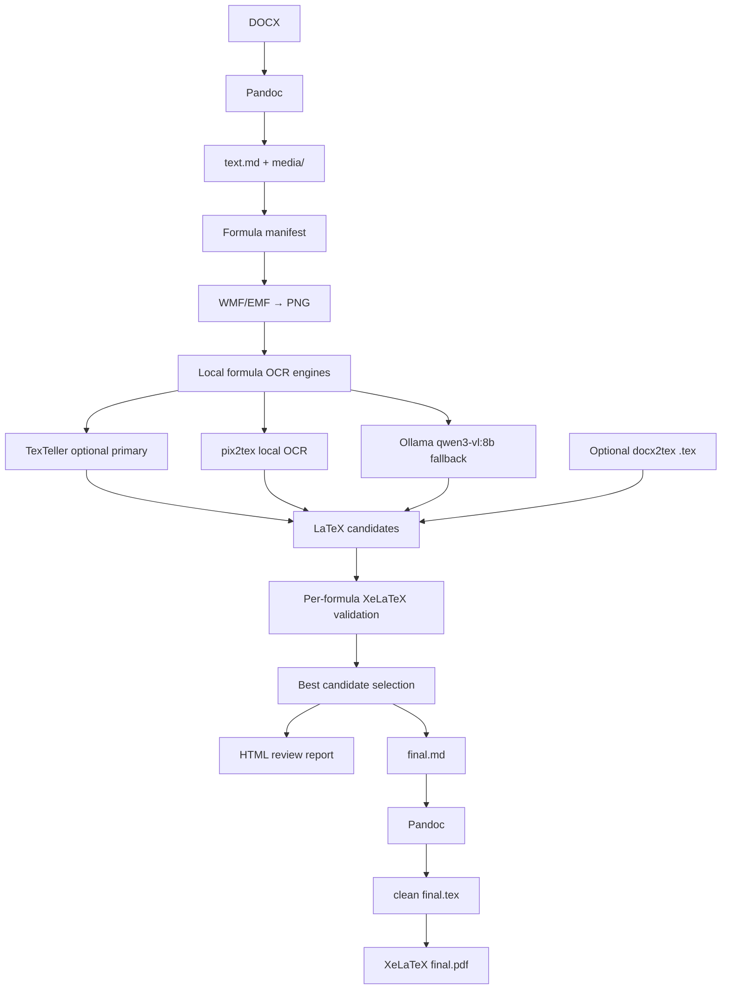

# dotex — DOCX → XeLaTeX for old mathematical papers

<p align="center">
  <b>Local-first pipeline for converting legacy mathematical DOCX papers with WMF/OLE formulas into clean Markdown, LaTeX formulas and XeLaTeX/PDF.</b>
</p>

<p align="center">
  
  
  
  
</p>

---

## What is this?

`dotex` / `docx2xelatex` is a local, controllable conversion pipeline for old scientific DOCX documents, especially mathematical papers where formulas are stored as legacy **WMF/OLE MathType / Equation Editor objects**.

The goal is not just “convert DOCX to PDF”. The goal is to recover a real, editable, modern XeLaTeX document:

```text
old DOCX → clean Markdown → recognized LaTeX formulas → final.md → final.tex → final.pdf
```

The project is designed for documents like old Russian-language mathematical papers, where the text is still readable by Pandoc, but formulas are embedded as images such as:

```markdown

```

Instead of trusting one magic converter, `dotex` treats every formula as a separate recoverable object.

---

## Why I created this

I had several old mathematical scientific papers written in DOCX. They contain a lot of formulas, but most of them are not modern Word OMML equations. They are old embedded objects with WMF previews.

I tried different tools and workflows:

* Pandoc
* MarkItDown
* MinerU
* Nougat
* PDF-based extraction
* DOCX → PDF → OCR approaches
* direct DOCX → LaTeX converters

They all helped in some places, but none of them gave a clean, reliable XeLaTeX result for this exact case.

Typical problems were:

* formulas became images instead of LaTeX;
* old WMF/OLE formulas were not recovered;
* generated `.tex` was too dirty to maintain;
* XeLaTeX compilation failed on broken formulas;
* formatting, italics and structure were partially lost;
* one bad formula could break the whole document.

So I built this project around a different idea:

> Use Pandoc for what it is good at — text and document structure.
> Use local vision/OCR models for what they are good at — formula recognition.
> Validate every formula independently.
> Never let one broken formula destroy the whole paper.

---

## Core idea

Each formula goes through its own lifecycle:

```text
image → png → candidates → validation → selection → merge
```

If a formula cannot be recognized or compiled, the final document is still generated. The original formula image stays in the Markdown and receives a `TODO_FORMULA_f0001` marker, so it can be fixed manually later.

This makes the pipeline practical for real archival work.

---

## How it works



### What each tool does

| Component                | Role                                                                                      |
| ------------------------ | ----------------------------------------------------------------------------------------- |
| **Pandoc**               | Extracts text, paragraphs, lists, italics, bold text and media from DOCX                  |
| **ImageMagick**          | Converts WMF/EMF formula previews into PNG                                                |
| **TexTeller**           | Optional primary local formula OCR engine from `external/TexTeller`                       |
| **pix2tex**              | Optional simple local formula OCR engine                                                  |
| **Ollama + qwen3-vl:8b** | Fallback local vision OCR engine                                                          |
| **XeLaTeX**              | Validates every candidate formula and builds final PDF                                    |
| **docx2tex**             | Optional: used only as an additional formula candidate source, not as final TeX generator |

---

## Why not use final `.tex` from docx2tex?

`docx2tex` can sometimes extract useful math from old OLE/MathType formulas, but its full generated `.tex` can be unstable and hard to maintain.

In this project, `docx2tex` is treated as an optional formula source only:

```text
docx2tex output → extract formula candidates → validate → maybe use
```

The final document is rebuilt cleanly:

```text
Pandoc Markdown → final.md → clean final.tex → XeLaTeX
```

---

## Privacy model

`dotex` is designed for confidential documents.

* Your DOCX files are processed locally.
* Formula images are processed locally.
* OCR uses local Ollama at `http://localhost:11434`.
* The project intentionally rejects non-localhost Ollama URLs.
* No document text, formulas or images are sent to external APIs.

Internet access is only needed when you install dependencies yourself.

---

## Requirements

Install these tools locally:

| Tool               | Purpose                              |
| ------------------ | ------------------------------------ |
| Python 3.11+       | Main project runtime                 |
| Pandoc             | DOCX → Markdown and Markdown → LaTeX |
| MiKTeX or TeX Live | XeLaTeX compilation                  |
| ImageMagick        | WMF/EMF → PNG                        |
| Ollama             | Local fallback vision model runtime  |
| `qwen3-vl:8b`      | Local fallback formula OCR model     |
| pix2tex            | Optional local formula OCR engine    |
| TexTeller          | Optional primary formula OCR engine  |

Install the model:

```powershell
ollama pull qwen3-vl:8b
```

Check that Ollama is running:

```powershell
ollama list
```

---

## Russian XeLaTeX preset

By default, `docx2xelatex` generates XeLaTeX suitable for Russian scientific documents on Windows + MiKTeX:

* `xelatex`
* `fontspec`
* `polyglossia` only; `babel` is not loaded in the default XeLaTeX preset
* `Times New Roman` as the main font
* `Arial` as the sans-serif font
* `Consolas` as the monospace font
* `amsmath`, `amssymb`, `mathtools` for formulas
* optional `unicode-math`, disabled by default and loaded after `mathtools` when enabled

The generated header explicitly defines Cyrillic font families for polyglossia, including monospace Cyrillic:

```tex
\newfontfamily\cyrillicfont{Times New Roman}[Script=Cyrillic]
\newfontfamily\cyrillicfontsf{Arial}[Script=Cyrillic]
\newfontfamily\cyrillicfonttt{Consolas}[Script=Cyrillic]
```

This avoids the common XeLaTeX/polyglossia error where `Courier New` or another monospace font is not recognized as supporting Cyrillic.

Check the local Russian XeLaTeX preset:

```powershell
docx2xelatex test-latex --config config.yaml --workdir build
```

The command creates and compiles a minimal document with Russian text, `\texttt{...}` Cyrillic text, and a simple formula. `doctor --config config.yaml` also reports the XeLaTeX engine, configured fonts, polyglossia/babel conflict status, and the minimal Russian compile result when `xelatex` is available.

---

## Installation

Clone the repository:

```powershell
git clone https://github.com/gerageragera39/dotex.git
cd dotex
```

Create a virtual environment:

```powershell
py -3 -m venv .venv
.\.venv\Scripts\Activate.ps1
```

Install the project:

```powershell
pip install -e .
```

Check your environment:

```powershell
docx2xelatex doctor
```

Expected checks:

* Python
* Pandoc
* ImageMagick `magick`
* XeLaTeX
* TexTeller status
* pix2tex status or warning if it is not installed
* Ollama
* `qwen3-vl:8b`

---

## Quickstart

Create config:

```powershell
docx2xelatex init-config --out config.yaml
```

Run the full pipeline:

```powershell
docx2xelatex full `
  --input "C:\path\to\work.docx" `
  --workdir "C:\path\to\build" `
  --config config.yaml
```

Your output will be in:

```text
build/
  text.md
  formulas/
  report/formulas.html
  final.md
  final.tex
  final.pdf
```

---

## Recommended controlled workflow

For real documents, step-by-step mode is better than `full`, because you can inspect formulas before building the final TeX.

Set paths:

```powershell
$Docx = "C:\path\to\work.docx"
$Build = "C:\path\to\build"
$Config = "C:\path\to\config.yaml"
```

Inspect DOCX internals:

```powershell
docx2xelatex inspect-docx --input $Docx --workdir $Build
```

This counts:

* `word/media/*.wmf`
* `word/media/*.emf`
* `word/embeddings/oleObject*.bin`
* OMML equations such as `<m:oMath>`

Create Markdown with formula images:

```powershell
docx2xelatex pandoc-md --input $Docx --workdir $Build --config $Config
```

Create formula manifest:

```powershell
docx2xelatex manifest `
  --markdown "$Build\text.md" `
  --workdir $Build `
  --config $Config
```

Render formula images:

```powershell
docx2xelatex render-images --workdir $Build --config $Config
```

Run local OCR with configured engines:

```powershell
docx2xelatex ocr --workdir $Build --config $Config --verbose
```

Run OCR for only one large formula:

```powershell
docx2xelatex ocr --workdir $Build --config $Config --only-id f0001 --force --verbose
docx2xelatex validate --workdir $Build --config $Config --only-id f0001 --force
docx2xelatex select --workdir $Build --config $Config
```

Validate all candidates:

```powershell
docx2xelatex validate --workdir $Build --config $Config
```

Select best formulas:

```powershell
docx2xelatex select --workdir $Build --config $Config
```

Generate review report:

```powershell
docx2xelatex report --workdir $Build --config $Config
Start-Process "$Build\report\formulas.html"
```

After reviewing formulas, merge and build:

```powershell
docx2xelatex merge --workdir $Build --config $Config
docx2xelatex build --workdir $Build --config $Config
```

---

## Formula review report

The HTML report is one of the most important parts of the project.

It shows:

* formula id;
* original image;
* selected LaTeX;
* candidate source;
* validation status;
* validation errors;
* links to validation logs.

Open it after OCR and validation:

```powershell
Start-Process "$Build\report\formulas.html"
```

A good workflow is:

1. Open the report.
2. Check red rows.
3. Fix bad formulas manually in `manifest.json`.
4. Re-run only the final stages.

---

## Manual formula correction

If OCR fails or produces a wrong formula, edit:

```text
build/formulas/manifest.json
```

Find the formula:

```json
{
  "id": "f0001",
  "selected_latex": null,
  "selected_source": null
}
```

Set:

```json
{
  "selected_latex": "\\frac{a}{b}",
  "selected_source": "manual"
}
```

Then rebuild only the tail:

```powershell
docx2xelatex merge --workdir $Build --config $Config
docx2xelatex build --workdir $Build --config $Config
```

---

## Optional: use docx2tex as a formula source

If you already generated a `.tex` file with `docx2tex`, you can add it as an additional source of formula candidates:

```powershell
docx2xelatex add-docx2tex-candidates `
  --workdir $Build `
  --docx2tex-tex "C:\path\to\docx2tex\out\work.tex" `
  --config $Config
```

Then rerun:

```powershell
docx2xelatex validate --workdir $Build --config $Config
docx2xelatex select --workdir $Build --config $Config
docx2xelatex report --workdir $Build --config $Config
```

Candidate priority can be controlled in `config.yaml`:

```yaml
candidate_selection:
  priority: ["texteller", "pix2tex", "ollama_qwen", "docx2tex"]
```

For my documents, `docx2tex` is usually more useful as a fallback candidate source than as the main converter.

---

## Optional formula OCR engines

The OCR stage keeps the same lifecycle:

```text
image → png → candidates → validate → select → merge
```

The default engine order is:

```yaml
ocr:
  engines: ["texteller", "pix2tex", "ollama_qwen"]

candidate_selection:
  priority: ["texteller", "pix2tex", "ollama_qwen", "docx2tex"]
```

Selection chooses the first independently validated candidate according to `candidate_selection.priority`. If TexTeller or pix2tex is unavailable, OCR records/prints a skip and Ollama remains available as the fallback engine. `doctor` reports TexTeller status and shows a warning when pix2tex is not installed.

### Install pix2tex

Inside your project virtual environment:

```powershell
.\.venv\Scripts\Activate.ps1
pip install pix2tex
# or, if you want its GUI extras:
pip install "pix2tex[gui]"
```

Then check:

```powershell
docx2xelatex doctor --config config.yaml
```

### Clone or install TexTeller

TexTeller is optional and is read from `external/TexTeller` by default:

```powershell
git clone https://github.com/OleehyO/TexTeller.git external/TexTeller
```

Install it in the same environment if you want the `texteller` console command:

```powershell
pip install -e external/TexTeller
```

If the CLI shape changes, configure the adapter command in `config.yaml`:

```yaml
texteller:
  enabled: true
  repo_path: "external/TexTeller"
  timeout_seconds: 180
  command: ["texteller", "inference", "{image_path}"]
  # or: command: ["python", "-m", "texteller.cli", "inference", "{image_path}"]
```

### Process only one large formula

```powershell
docx2xelatex ocr --workdir build --config config.yaml --only-id f0001 --force --verbose
docx2xelatex validate --workdir build --config config.yaml --only-id f0001 --force
docx2xelatex select --workdir build --config config.yaml
```

---

## Project artifacts

Typical workdir structure:

```text
build/
  text.md                         # Markdown generated by Pandoc
  media/                          # extracted DOCX images
  formulas/
    manifest.json                 # lifecycle state of every formula
    png/
      f0001.png                   # rendered formula image
    ocr/
      f0001_texteller.json        # raw TexTeller status/result
      f0001_pix2tex.json          # raw pix2tex status/result
      f0001_ollama_qwen.json      # raw Ollama status/result
    validate/
      f0001/
        candidate_*.tex           # minimal validation files
        candidate_*.log           # XeLaTeX logs
        candidate_*.pdf           # rendered candidate if valid
  report/
    formulas.html                 # visual formula review report
  final.md                        # Markdown with LaTeX formulas or TODOs
  final.tex                       # clean Pandoc-generated XeLaTeX
  final.pdf                       # final PDF if build succeeds
  final.log                       # final XeLaTeX log
```

---

## Configuration

Create default config:

```powershell
docx2xelatex init-config --out config.yaml
```

Important options:

```yaml
ocr:
  engines: ["texteller", "pix2tex", "ollama_qwen"]

texteller:
  enabled: true
  repo_path: "external/TexTeller"
  timeout_seconds: 180
  command: null   # auto; or set a list/string with {image_path}

pix2tex:
  enabled: true
  timeout_seconds: 180

ollama:
  enabled: true
  base_url: "http://localhost:11434"
  model: "qwen3-vl:8b"
  timeout_seconds: 1200
  resize_image: false
  max_image_side: 2400
  num_predict: null

candidate_selection:
  priority: ["texteller", "pix2tex", "ollama_qwen", "docx2tex"]

latex:
  engine: xelatex
  mainfont: "Times New Roman"
  sansfont: "Arial"
  monofont: "Consolas"
  documentclass: article
  fontsize: 12pt
  lang: ru-RU
  main_language: russian
  other_languages:
    - english
  build_pdf: true
  halt_on_error: false
  use_polyglossia: true
  use_babel: false
  use_unicode_math: false
```

Disable an engine without changing the rest of the pipeline:

```yaml
texteller:
  enabled: false

pix2tex:
  enabled: false

ollama:
  enabled: true
```

Or change engine run order:

```yaml
ocr:
  engines: ["pix2tex", "ollama_qwen"]
```

If OCR is too slow, try:

```yaml
ollama:
  resize_image: true
  max_image_side: 2400
```

If recognition quality drops, switch back to:

```yaml
ollama:
  resize_image: false
```

---

## CLI commands

| Command                   | Description                                                       |
| ------------------------- | ----------------------------------------------------------------- |
| `doctor`                  | Check local dependencies and Russian XeLaTeX preset               |
| `test-latex`              | Compile a minimal Russian XeLaTeX smoke-test document             |
| `init-config`             | Create YAML config                                                |
| `inspect-docx`            | Count DOCX formula/media internals without printing document text |
| `pandoc-md`               | Convert DOCX to Markdown and extract media                        |
| `manifest`                | Find formula images and create manifest                           |
| `render-images`           | Convert WMF/EMF formulas to PNG                                   |
| `ocr`                     | Run configured local formula OCR engines                           |
| `add-docx2tex-candidates` | Add candidates from docx2tex-generated `.tex`                     |
| `validate`                | Compile every candidate formula separately                        |
| `select`                  | Select the best valid candidate                                   |
| `report`                  | Generate HTML formula review report                               |
| `merge`                   | Replace image formulas with LaTeX in Markdown                     |
| `build`                   | Generate clean final TeX/PDF                                      |
| `full`                    | Run the main pipeline                                             |

Useful OCR/validate options:

```powershell
docx2xelatex ocr --workdir $Build --config $Config --verbose
docx2xelatex ocr --workdir $Build --config $Config --timeout-seconds 1200
docx2xelatex ocr --workdir $Build --config $Config --only-id f0001 --force --verbose
docx2xelatex ocr --workdir $Build --config $Config --from-id f0010 --to-id f0020 --limit 5
docx2xelatex validate --workdir $Build --config $Config --only-id f0001 --force
```

---

## Troubleshooting

### `magick` not found

Install ImageMagick and restart PowerShell:

```powershell
magick -version
docx2xelatex doctor
```

### `xelatex` not found

Install MiKTeX or TeX Live:

```powershell
xelatex --version
```

### Russian XeLaTeX preset fails

Run:

```powershell
docx2xelatex test-latex --workdir $Build --config $Config
docx2xelatex doctor --config $Config
```

For the default XeLaTeX preset, keep only one language system enabled:

```yaml
latex:
  use_polyglossia: true
  use_babel: false
```

Do not enable `use_babel: true` together with `use_polyglossia: true`; build validation rejects that combination.

### Ollama unavailable

Check Ollama:

```powershell
ollama list
```

The project only supports local Ollama URLs such as:

```text
http://localhost:11434
```

### Model not found

Install the model:

```powershell
ollama pull qwen3-vl:8b
```

### OCR is slow

Vision models can be slow on large formula images. Use verbose mode:

```powershell
docx2xelatex ocr --workdir $Build --config $Config --verbose
```

Check current OCR status:

```powershell
Get-Content "$Build\formulas\ocr\f0001_texteller.json"
Get-Content "$Build\formulas\ocr\f0001_pix2tex.json"
Get-Content "$Build\formulas\ocr\f0001_ollama_qwen.json"
```

### A formula fails validation

Open the validation files:

```text
build/formulas/validate/f0001/
```

Then either:

* fix the candidate manually in `manifest.json`;
* add a better candidate;
* leave the original image with `TODO_FORMULA_f0001`.

### Final PDF fails but `final.tex` exists

This is recoverable. Open:

```text
build/final.tex
build/final.log
```

The project keeps intermediate files so the result can be debugged.

---

## Development

Install dev dependencies:

```powershell
py -3 -m venv .venv
.\.venv\Scripts\Activate.ps1
pip install -e .[dev]
```

Run tests:

```powershell
pytest
```

---

## Roadmap

Planned improvements:

* better formula candidate ranking;
* side-by-side formula rendering comparison;
* batch processing for multiple papers;
* improved table handling;
* better support for numbered equations;
* optional manual review UI.

---

## Philosophy

This project is built around one practical principle:

> A document conversion pipeline should be inspectable, resumable and recoverable.

Old scientific documents are messy. Formula extraction will not be perfect. But a good pipeline should make every failure visible, local and fixable — instead of producing one giant broken `.tex` file.
