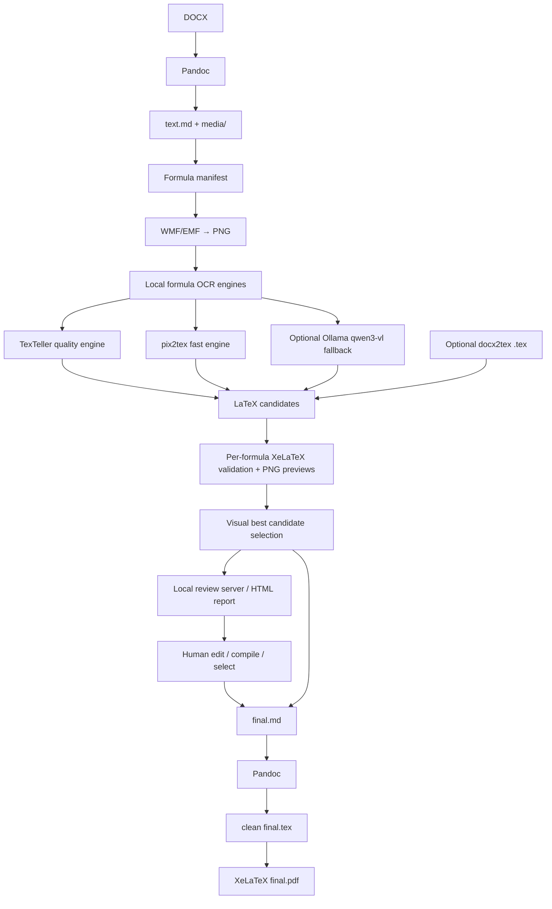

# dotex — DOCX → XeLaTeX for old mathematical papers

<p align="center">
  <b>Local-first pipeline for converting legacy mathematical DOCX papers with WMF/OLE formulas into clean Markdown, LaTeX formulas and XeLaTeX/PDF.</b>
</p>

<p align="center">
  
  
  
  
  
</p>

---

## What is this?

`dotex` / `docx2xelatex` is a local, controllable conversion pipeline for old scientific DOCX documents, especially mathematical papers where formulas are stored as legacy **WMF/OLE MathType / Equation Editor objects**.

The goal is not just “convert DOCX to PDF”. The goal is to recover a real, editable, modern XeLaTeX document:

```text
old DOCX → clean Markdown → recognized LaTeX formulas → final.md → final.tex → final.pdf
```

The project is designed for documents like old Russian-language mathematical papers, where the text is still readable by Pandoc, but formulas are embedded as images such as:

```markdown

```

Instead of trusting one magic converter, `dotex` treats every formula as a separate recoverable object.

---

## Why I created this

I had several old mathematical scientific papers written in DOCX. They contain a lot of formulas, but most of them are not modern Word OMML equations. They are old embedded objects with WMF previews.

I tried different tools and workflows:

* Pandoc
* MarkItDown
* MinerU
* Nougat
* PDF-based extraction
* DOCX → PDF → OCR approaches
* direct DOCX → LaTeX converters

They all helped in some places, but none of them gave a clean, reliable XeLaTeX result for this exact case.

Typical problems were:

* formulas became images instead of LaTeX;
* old WMF/OLE formulas were not recovered;
* generated `.tex` was too dirty to maintain;
* XeLaTeX compilation failed on broken formulas;
* formatting, italics and structure were partially lost;
* one bad formula could break the whole document.

So I built this project around a different idea:

> Use Pandoc for what it is good at — text and document structure.
> Use specialized local OCR models for what they are good at — formula recognition.
> Validate every formula independently.
> Never let one broken formula destroy the whole paper.

---

## Core idea

Each formula goes through its own lifecycle:

```text
image → png → candidates → validation → selection → merge
```

If a formula cannot be recognized or compiled, the final document is still generated with a PNG preview and a `TODO_FORMULA_f0001` marker, so it can be fixed manually later.

Legacy WMF/EMF formula images are not allowed into `final.md` / `final.tex`.

This makes the pipeline practical for real archival work.

---

## How it works



### What each tool does

| Component                | Role                                                                     |
| ------------------------ | ------------------------------------------------------------------------ |
| **Pandoc**               | Extracts text, paragraphs, lists, italics, bold text and media from DOCX |
| **ImageMagick**          | Converts WMF/EMF formula previews into PNG                               |
| **pix2tex**              | Fast local formula OCR engine                                            |
| **TexTeller**            | Higher-quality formula OCR engine, useful for harder formulas            |
| **Ollama + qwen3-vl:8b** | Optional local vision fallback                                           |
| **XeLaTeX**              | Validates every candidate formula and builds final PDF                   |
| **review server**        | Local browser UI to inspect, edit, compile and select formula candidates |
| **docx2tex**             | Optional additional formula candidate source, not final TeX generator    |

---

## Why not use final `.tex` from docx2tex?

`docx2tex` can sometimes extract useful math from old OLE/MathType formulas, but its full generated `.tex` can be unstable and hard to maintain.

In this project, `docx2tex` is treated as an optional formula source only:

```text
docx2tex output → extract formula candidates → validate → maybe use
```

The final document is rebuilt cleanly:

```text
Pandoc Markdown → final.md → clean final.tex → XeLaTeX
```

---

## Privacy model

`dotex` is designed for confidential documents.

* Your DOCX files are processed locally.
* Formula images are processed locally.
* Default OCR engines run locally in your Python environment.
* Optional Ollama fallback uses local Ollama at `http://localhost:11434`.
* The project intentionally rejects non-localhost Ollama URLs.
* No document text, formulas or images are sent to external APIs.

Internet access is only needed when you install dependencies yourself.

---

## Requirements

Install these tools locally:

| Tool               | Purpose                              |
| ------------------ | ------------------------------------ |
| Python 3.11+       | Main project runtime                 |
| Pandoc             | DOCX → Markdown and Markdown → LaTeX |
| MiKTeX or TeX Live | XeLaTeX compilation                  |
| ImageMagick        | WMF/EMF → PNG                        |
| pix2tex            | Fast local formula OCR               |
| TexTeller          | Higher-quality local formula OCR     |
| Ollama             | Optional fallback vision runtime     |
| `qwen3-vl:8b`      | Optional fallback vision model       |

---

## Russian XeLaTeX preset

By default, `docx2xelatex` generates XeLaTeX suitable for Russian scientific documents on Windows + MiKTeX:

* `xelatex`
* `fontspec`
* `polyglossia` only; `babel` is not loaded in the default XeLaTeX preset
* `Times New Roman` as the main font
* `Arial` as the sans-serif font
* `Consolas` as the monospace font
* `amsmath`, `amssymb`, `mathtools` for formulas
* optional `unicode-math`, disabled by default and loaded after `mathtools` when enabled

The generated header explicitly defines Cyrillic font families for polyglossia, including monospace Cyrillic:

```tex
\newfontfamily\cyrillicfont{Times New Roman}[Script=Cyrillic]
\newfontfamily\cyrillicfontsf{Arial}[Script=Cyrillic]
\newfontfamily\cyrillicfonttt{Consolas}[Script=Cyrillic]
```

Check the local Russian XeLaTeX preset:

```powershell
docx2xelatex test-latex --config config_pix2tex.yaml --workdir build
```

---

# Installation

## Option 1 — standard CPU install

Use this if you just want the project to work locally.

```powershell
git clone https://github.com/gerageragera39/dotex.git
cd dotex

py -3 -m venv .venv
.\.venv\Scripts\Activate.ps1

pip install -r requirements.txt
```

This installs the project and the default OCR stack.

## Option 2 — NVIDIA GPU install

Use this if you have an NVIDIA GPU and want OCR to run faster.

```powershell
git clone https://github.com/gerageragera39/dotex.git
cd dotex

py -3 -m venv .venv
.\.venv\Scripts\Activate.ps1

pip install -r requirements-gpu.txt
```

Check PyTorch CUDA:

```powershell
python -c "import torch; print('torch:', torch.__version__); print('cuda:', torch.cuda.is_available()); print('device:', torch.cuda.get_device_name(0) if torch.cuda.is_available() else None)"
```

Check ONNX Runtime providers:

```powershell
python -c "import onnxruntime as ort; print('onnxruntime:', ort.__version__); print('providers:', ort.get_available_providers())"
```

Good GPU output should include:

```text
cuda: True
CUDAExecutionProvider
```

---

# Config presets

The repository includes ready-to-use configs. All configs are merged with built-in defaults, so newer options such as validation previews, visual scoring, OCR variants, display-type overrides and review-server support work even if an older YAML file does not list every key.

## Which config should I use?

Short answer:

* **Best first choice for most real papers:** `config_texteller.yaml`, if TexTeller is installed and works on your machine. It is slower, but usually gives better formula OCR for difficult scientific formulas.
* **Best troubleshooting / quick smoke-test choice:** `config_pix2tex.yaml` or `config.yaml`. It is simpler and faster, but formula quality may be lower.
* **Best quality workflow:** run multiple local engines and use the review UI. If you have both TexTeller and pix2tex installed, prefer a combined config with both engines enabled so the selector and review UI can compare candidates.

Recommended combined OCR block for quality runs:

```yaml
ocr:
  engines:
    - texteller
    - pix2tex

texteller:
  enabled: true

pix2tex:
  enabled: true

candidate_selection:
  strategy: visual_best
  min_visual_score: 0.70
  priority:
    - texteller
    - pix2tex
    - ollama_qwen
    - docx2tex
```

Use this only after `docx2xelatex doctor --config your-config.yaml` says both engines are available.

## `config_pix2tex.yaml` / `config.yaml`

Fast and simple OCR mode:

```yaml
ocr:
  engines:
    - pix2tex
```

Recommended for:

* quick tests;
* checking Pandoc/ImageMagick/XeLaTeX setup;
* small documents;
* debugging the pipeline before installing TexTeller.

## `config_texteller.yaml`

Higher-quality TexTeller mode. In the current preset it runs TexTeller as the OCR engine:

```yaml
ocr:
  engines:
    - texteller
```

Recommended for:

* final runs when TexTeller is installed;
* difficult formulas;
* better first-pass formula quality.

If you also have pix2tex installed, add `pix2tex` to `ocr.engines` as shown above. That gives the review UI more candidates to compare.

## Optional Ollama fallback

Ollama is disabled by default. Use it only with a local Ollama server. The tool rejects non-localhost Ollama URLs for privacy.

```yaml
ollama:
  enabled: true
  model: qwen3-vl:8b

ocr:
  engines:
    - texteller
    - pix2tex
    - ollama_qwen
```

Install the model:

```powershell
ollama pull qwen3-vl:8b
```

## New useful config options

```yaml
ocr:
  # Default is 1 for safety. For GPU OCR, try 2 first, then 3-4 if VRAM is OK.
  max_workers: 2

images:
  ocr_variants:
    - original
    - padded
    - trimmed_padded
    - grayscale_contrast
    - binarized
  padding_px: 24

validation:
  render_preview: true
  preview_density: 300
  preview_trim: true
  preview_padding: 12

merge:
  default_formula_display: auto
  invalid_formula_policy: keep_image_with_todo
  allow_invalid_formula_fallback: true
  inline_wrapper: "\\({latex}\\)"
  display_wrapper: "\\[\n{latex}\n\\]"
```

For production archival work, keep `allow_invalid_formula_fallback: true`: invalid formulas become PNG TODO fallbacks instead of breaking the whole document. If you want CI-style strictness, set it to `false`.

For GPU OCR throughput, start with `ocr.max_workers: 2`. Increase to `3` or `4` only if GPU memory is stable. More workers can be slower or crash if each worker loads its own model copy.

---

# Quick start: run, review, build

The recommended workflow is now:

```text
DOCX → OCR/validate/select → local review UI → merge → build → audit
```

The review UI is important: it lets you inspect every formula, edit LaTeX, compile a manual candidate, select the best candidate, and switch inline/display mode without editing `manifest.json` by hand.

## 1. Set variables

From the project directory:

```powershell
cd "C:\Users\SED\Documents\dotex\docx2xelatex"
.\.venv\Scripts\Activate.ps1

$Project = "C:\Users\SED\Documents\dotex\docx2xelatex"
$Docx = "$Project\example.docx"
$Build = "$Project\build"

# Best quality if TexTeller is installed:
$Config = "$Project\config_texteller.yaml"

# Faster fallback / smoke-test config:
# $Config = "$Project\config_pix2tex.yaml"
```

## 2. Check environment

```powershell
docx2xelatex config-show --config $Config
docx2xelatex doctor --config $Config
docx2xelatex test-latex --config $Config --workdir $Build
```

Do not continue until `doctor` can find the tools you need: Pandoc, ImageMagick `magick`, XeLaTeX, and the OCR engine(s) enabled in your config.

## 3. Run the automatic pass

```powershell
Remove-Item $Build -Recurse -Force -ErrorAction SilentlyContinue

docx2xelatex full `
  --input $Docx `
  --workdir $Build `
  --config $Config `
  --force
```

This creates `text.md`, formula PNGs, OCR candidates, validation logs/previews, `report/formulas.html`, `final.md`, `final.tex`, and `final.pdf` when the final XeLaTeX build succeeds. Formulas that cannot be safely selected are kept as PNG TODO fallbacks.

## 4. Start the local formula review UI

```powershell
docx2xelatex review `
  --workdir $Build `
  --config $Config `
  --host 127.0.0.1 `
  --port 8765
```

Open:

```text
http://127.0.0.1:8765/formulas.html
```

The server binds to `127.0.0.1` by default for privacy. Use the UI to:

* compare original formula PNGs with rendered candidate previews;
* filter invalid, unresolved, manual or low-score formulas;
* edit LaTeX in a textarea;
* compile/recompile one formula;
* select an OCR or manual candidate;
* mark a formula as inline or display;
* call merge/build from the browser.

Manual selections are preserved when you rerun `select`. To override them automatically, use:

```powershell
docx2xelatex select --workdir $Build --config $Config --force-auto-select
```

## 5. Merge, build, audit

After review corrections:

```powershell
docx2xelatex merge --workdir $Build --config $Config --strict
docx2xelatex build --workdir $Build --config $Config --force
docx2xelatex audit --workdir $Build --config $Config
```

Open results:

```powershell
Start-Process "$Build\report\formulas.html"
Start-Process "$Build\final.pdf"
```

`audit` reports unresolved formulas, stale validation artifacts, missing previews, selected invalid formulas, forbidden WMF/EMF refs in `final.md`, and final XeLaTeX compile status.

---

# Recommended run modes

## Fast mode: pix2tex only

Use for installation checks and quick iterations:

```powershell
$Config = "$Project\config_pix2tex.yaml"

docx2xelatex full --input $Docx --workdir $Build --config $Config --force
docx2xelatex review --workdir $Build --config $Config
```

Expected OCR output:

```text
OCR effective engines: ['pix2tex']
```

## Quality mode: TexTeller

Use for serious formula recovery if TexTeller is installed:

```powershell
$Config = "$Project\config_texteller.yaml"

docx2xelatex full --input $Docx --workdir $Build --config $Config --force
docx2xelatex review --workdir $Build --config $Config
```

Expected OCR output for the current preset:

```text
OCR effective engines: ['texteller']
```

## Best comparison mode: TexTeller + pix2tex

For best human-review results, use a config that runs both engines. Copy `config_texteller.yaml`, enable pix2tex, and set:

```yaml
ocr:
  engines:
    - texteller
    - pix2tex

pix2tex:
  enabled: true

candidate_selection:
  strategy: visual_best
  priority:
    - texteller
    - pix2tex
    - ollama_qwen
    - docx2tex
```

Then run the same `full` + `review` flow. This is usually the best mode when both engines are available, because the selector can use visual score and you can compare alternatives in the browser.

---

# Step-by-step workflow

For real documents, step-by-step mode is often better than `full`, because you can inspect formulas before building the final TeX/PDF.

## 1. Set paths

```powershell
cd "C:\Users\SED\Documents\dotex\docx2xelatex"
.\.venv\Scripts\Activate.ps1

$Project = "C:\Users\SED\Documents\dotex\docx2xelatex"
$Docx = "$Project\example.docx"
$Build = "$Project\build"
$Config = "$Project\config_texteller.yaml"
```

Use pix2tex-only mode instead:

```powershell
$Config = "$Project\config_pix2tex.yaml"
```

## 2. Start clean

```powershell
Remove-Item $Build -Recurse -Force -ErrorAction SilentlyContinue
```

## 3. Inspect DOCX internals

```powershell
docx2xelatex inspect-docx --input $Docx --workdir $Build
```

This counts:

* `word/media/*.wmf`
* `word/media/*.emf`
* `word/embeddings/oleObject*.bin`
* OMML equations such as `<m:oMath>`

## 4. Convert DOCX to Markdown

```powershell
docx2xelatex pandoc-md `
  --input $Docx `
  --workdir $Build `
  --config $Config
```

## 5. Create formula manifest

```powershell
docx2xelatex manifest `
  --markdown "$Build\text.md" `
  --workdir $Build `
  --config $Config
```

## 6. Render formula images

```powershell
docx2xelatex render-images --workdir $Build --config $Config
```

## 7. Run OCR

```powershell
docx2xelatex ocr `
  --workdir $Build `
  --config $Config `
  --verbose
```

## 8. Validate candidates

```powershell
docx2xelatex validate --workdir $Build --config $Config
```

## 9. Select best formulas

```powershell
docx2xelatex select --workdir $Build --config $Config
```

## 10. Review formulas interactively

Generate the static report if you only need read-only inspection:

```powershell
docx2xelatex report --workdir $Build --config $Config
Start-Process "$Build\report\formulas.html"
```

For editing and selecting formulas, start the local review server instead:

```powershell
docx2xelatex review --workdir $Build --config $Config --host 127.0.0.1 --port 8765
```

Open `http://127.0.0.1:8765/formulas.html`, fix suspicious formulas, compile manual edits, select the desired candidate, and override inline/display when needed.

## 11. Merge, build and audit

```powershell
docx2xelatex merge --workdir $Build --config $Config --strict
docx2xelatex build --workdir $Build --config $Config --force
docx2xelatex audit --workdir $Build --config $Config
```

Open the result:

```powershell
Start-Process "$Build\final.pdf"
```

---

# Process only one formula

Useful when one formula is bad and you want to test OCR engines only on it.

```powershell
$FormulaId = "f0004"

docx2xelatex ocr `
  --workdir $Build `
  --config $Config `
  --only-id $FormulaId `
  --force `
  --verbose

docx2xelatex validate `
  --workdir $Build `
  --config $Config `
  --only-id $FormulaId `
  --force

docx2xelatex select --workdir $Build --config $Config
docx2xelatex report --workdir $Build --config $Config

Start-Process "$Build\report\formulas.html"
```

Then rebuild only the tail:

```powershell
docx2xelatex merge --workdir $Build --config $Config --strict
docx2xelatex build --workdir $Build --config $Config --force
```

---

# Formula review UI and report

There are now two formula-review surfaces. For a detailed button-by-button guide, see [`docs/REVIEW_UI.md`](docs/REVIEW_UI.md).

## Interactive local review server

Start it after `validate` + `select`, or after `full`:

```powershell
docx2xelatex review --workdir $Build --config $Config --host 127.0.0.1 --port 8765
```

Open:

```text
http://127.0.0.1:8765/formulas.html
```

The UI shows:

* a large original formula PNG panel with **Fit panel**, **Actual size** and **Open image** controls;
* current selected LaTeX;
* rendered preview of the selected LaTeX;
* all OCR/manual candidates with source, status, error, visual score and preview;
* editable textarea for manual LaTeX;
* buttons to compile/recompile, select a candidate, merge, build and audit;
* inline/display toggle with explanations in the page;
* filters for invalid, unresolved, low visual score and manual formulas;
* search by formula id or LaTeX text.

Important: **inline** means the formula is inserted inside a sentence as `\( latex \)`. **Display** means the formula is inserted as a standalone equation block `\[ latex \]`. Use inline for small formulas in text; use display for standalone equations, tall fractions, sums, matrices or multi-line formulas.

Manual edits are saved as `source: "manual"` candidates in `build/formulas/manifest.json`. The manifest is updated atomically.

## Static read-only report

If you only need a static report:

```powershell
docx2xelatex report --workdir $Build --config $Config
Start-Process "$Build\report\formulas.html"
```

The report includes candidate previews when available, but it cannot compile or select formulas.

## Manual correction workflow

Prefer the review UI over hand-editing JSON:

1. Paste or type corrected LaTeX into the formula textarea.
2. Click **Compile/recompile this formula**.
3. If it validates and looks right, click **Select textarea** or select the new manual candidate.
4. Run merge/build/audit.

```powershell
docx2xelatex merge --workdir $Build --config $Config --strict
docx2xelatex build --workdir $Build --config $Config --force
docx2xelatex audit --workdir $Build --config $Config
```

If you must edit JSON manually, update `build/formulas/manifest.json`, but be careful: the review UI also stores validation artifacts, preview paths and selected candidate keys.

---

# Project artifacts

Typical workdir structure:

```text
build/
  text.md                         # Markdown generated by Pandoc
  media/                          # extracted DOCX images
  formulas/
    manifest.json                 # lifecycle state of every formula
    png/
      f0001.png                   # rendered formula image
    ocr/
      f0001_texteller_original.json        # raw TexTeller status/result
      f0001_pix2tex_original.json          # raw pix2tex status/result
      f0001_ollama_qwen_original.json      # raw Ollama status/result
      variants/                            # optional OCR image variants
    validate/
      f0001/
        candidate_*.tex           # minimal validation files
        candidate_*.log           # XeLaTeX logs
        candidate_*.pdf           # rendered candidate if valid
        candidate_*.png           # cropped preview used by report/review UI
  report/
    formulas.html                 # visual formula review report
  final.md                        # Markdown with LaTeX formulas or TODOs
  final.tex                       # clean Pandoc-generated XeLaTeX
  final.pdf                       # final PDF if build succeeds
  final.log                       # final XeLaTeX log
  final.build.log                 # captured build output
```

---

# Configuration notes

## `ocr.engines` vs `candidate_selection.priority`

These two settings do different things.

`ocr.engines` controls which OCR engines actually run:

```yaml
ocr:
  engines:
    - texteller
    - pix2tex
```

`candidate_selection.priority` controls which already-produced valid candidate is preferred:

```yaml
candidate_selection:
  priority:
    - texteller
    - pix2tex
    - ollama_qwen
    - docx2tex
```

If an engine is disabled, it will not run even if it appears in `ocr.engines`.

Check effective configuration:

```powershell
docx2xelatex config-show --config $Config
docx2xelatex doctor --config $Config
```

---

## Formula selection behavior

Selection order is:

1. existing manual selection, unless `--force-auto-select` is used;
2. valid candidate with best visual score above `candidate_selection.min_visual_score`;
3. valid candidate by `candidate_selection.priority`;
4. unresolved PNG TODO fallback.

Every candidate keeps raw OCR output separately from cleaned/normalized LaTeX. Conservative repair variants are added as extra candidates instead of overwriting raw OCR.

## Inline vs display formulas

The manifest stores:

```text
display_type_auto
display_type_manual
display_type
```

`display_type_manual` wins when present. The review UI can override inline/display. Merge uses:

```yaml
merge:
  inline_wrapper: "\\({latex}\\)"
  display_wrapper: "\\[\n{latex}\n\\]"
```

---

# CLI commands

| Command                   | Description                                                       |
| ------------------------- | ----------------------------------------------------------------- |
| `doctor`                  | Check local dependencies and Russian XeLaTeX preset               |
| `test-latex`              | Compile a minimal Russian XeLaTeX smoke-test document             |
| `config-show`             | Show merged config and effective OCR engines                      |
| `install-extras`          | Install optional pix2tex or TexTeller dependencies                |
| `init-config`             | Create YAML config                                                |
| `inspect-docx`            | Count DOCX formula/media internals without printing document text |
| `pandoc-md`               | Convert DOCX to Markdown and extract media                        |
| `manifest`                | Find formula images and create manifest                           |
| `render-images`           | Convert WMF/EMF formulas to PNG                                   |
| `ocr`                     | Run configured local formula OCR engines                          |
| `add-docx2tex-candidates` | Add candidates from docx2tex-generated `.tex`                     |
| `validate`                | Compile every candidate formula separately                        |
| `select`                  | Select the best valid candidate                                   |
| `report`                  | Generate static read-only HTML formula report                     |
| `review`                  | Start local interactive formula review server                     |
| `merge`                   | Replace image formulas with LaTeX in Markdown                     |
| `build`                   | Generate clean final TeX/PDF                                      |
| `audit`                   | Check formula/build reliability after selection and merge         |
| `full`                    | Run the full pipeline                                             |

Useful options:

```powershell
docx2xelatex ocr --workdir $Build --config $Config --verbose
docx2xelatex ocr --workdir $Build --config $Config --max-workers 2 --verbose
docx2xelatex ocr --workdir $Build --config $Config --only-id f0001 --force --verbose
docx2xelatex ocr --workdir $Build --config $Config --from-id f0010 --to-id f0020 --limit 5
docx2xelatex validate --workdir $Build --config $Config --only-id f0001 --force
docx2xelatex select --workdir $Build --config $Config --force-auto-select
docx2xelatex review --workdir $Build --config $Config --host 127.0.0.1 --port 8765
docx2xelatex merge --workdir $Build --config $Config --strict
docx2xelatex build --workdir $Build --config $Config --force
docx2xelatex audit --workdir $Build --config $Config
```

---

# Troubleshooting

## `magick` not found

Install ImageMagick and restart PowerShell:

```powershell
magick -version
docx2xelatex doctor --config $Config
```

## `xelatex` not found

Install MiKTeX or TeX Live:

```powershell
xelatex --version
docx2xelatex doctor --config $Config
```

## Russian XeLaTeX preset fails

Run:

```powershell
docx2xelatex test-latex --workdir $Build --config $Config
docx2xelatex doctor --config $Config
```

For the default XeLaTeX preset, keep only one language system enabled:

```yaml
latex:
  use_polyglossia: true
  use_babel: false
```

Do not enable `use_babel: true` together with `use_polyglossia: true`.

## `final.tex` contains `.wmf` / `.emf`

This is a merge invariant failure. Run:

```powershell
docx2xelatex merge --workdir $Build --config $Config --strict
Get-Content "$Build\merge-unresolved.json" -Raw
```

`build` refuses to run Pandoc if `final.md` still contains manifest formula WMF/EMF references.

Unresolved formulas are replaced with PNG previews plus `TODO_FORMULA_*`, not WMF/EMF.

## TexTeller is not installed

Try the standard install first:

```powershell
pip install texteller
```

If `doctor` reports missing dependencies, install project extras:

```powershell
pip install -r requirements.txt
```

or GPU dependencies:

```powershell
pip install -r requirements-gpu.txt
```

If the specific missing module is `optimum`:

```powershell
pip install "optimum[onnxruntime]>=1.24.0"
```


## GPU OCR is available but utilization is low

First make sure you are using the same environment where you installed requirements. For your `.test_venv`:

```powershell
.\.test_venv\Scripts\Activate.ps1
python -m pip show docx2xelatex
python -c "import sys; print(sys.executable)"
docx2xelatex doctor --config $Config
```

`doctor` prints both PyTorch CUDA and ONNX Runtime providers. This distinction matters:

* pix2tex is PyTorch-based, so `torch.cuda.is_available()` is the important check.
* TexTeller may use ONNX Runtime for parts of its pipeline, so you also need `CUDAExecutionProvider` in `onnxruntime.get_available_providers()`.
* PyTorch CUDA can work while ONNX Runtime is CPU-only. In that case, TexTeller can still use CPU even though your PyTorch test succeeds.

Check manually inside `.test_venv`:

```powershell
python -c "import torch; print(torch.__version__, torch.version.cuda, torch.cuda.is_available()); print(torch.cuda.get_device_name(0) if torch.cuda.is_available() else None)"
python -c "import onnxruntime as ort; print(ort.__version__); print(ort.get_available_providers())"
```

If ONNX Runtime does not list `CUDAExecutionProvider`, install a GPU-compatible ONNX Runtime build in `.test_venv` and make sure its CUDA/cuDNN requirements match your system.

The OCR pipeline used to run formula tasks one by one. Current versions support parallel OCR tasks:

```powershell
docx2xelatex ocr `
  --workdir $Build `
  --config $Config `
  --max-workers 2 `
  --force `
  --verbose
```

or in YAML:

```yaml
ocr:
  max_workers: 2
```

Start with `2`. If GPU memory is fine, try `3` or `4`. Do not set a very high value: pix2tex/TexTeller workers may each keep a model in memory, and too many workers can reduce speed or run out of VRAM.

During OCR, the log should say something like:

```text
OCR: selected_formulas=..., requested_engines=..., mode=parallel, max_workers=2
OCR engine pix2tex: ..., mode=parallel, max_workers=2
```

If it still says `mode=sequential`, your config/CLI is not setting `max_workers` above 1.

## OCR runs on CPU instead of GPU

Check PyTorch:

```powershell
python -c "import torch; print(torch.__version__); print(torch.version.cuda); print(torch.cuda.is_available()); print(torch.cuda.get_device_name(0) if torch.cuda.is_available() else None)"
```

Check ONNX Runtime:

```powershell
python -c "import onnxruntime as ort; print(ort.__version__); print(ort.get_available_providers())"
```

For GPU install, use:

```powershell
pip install -r requirements-gpu.txt
```

## Ollama unavailable

Ollama is optional. Check it only if you enabled `ollama_qwen`:

```powershell
ollama list
```

Install the model:

```powershell
ollama pull qwen3-vl:8b
```

## UnicodeDecodeError from external tools

This should not happen in current versions. External commands are captured in bytes mode and decoded safely. If it happens, run:

```powershell
docx2xelatex doctor --config $Config
```

and open an issue with the command output.

## A formula fails validation

Open the validation files:

```text
build/formulas/validate/f0001/
```

Then either:

* choose another candidate;
* fix the formula manually in `manifest.json`;
* leave it as PNG + `TODO_FORMULA_f0001`.

---

# Development

Install dev dependencies:

```powershell
py -3 -m venv .venv
.\.venv\Scripts\Activate.ps1
pip install -e ".[dev]"
```

Run tests:

```powershell
pytest
```

---

# Roadmap

Planned improvements:

* batch processing for multiple papers;
* improved table handling;
* better support for numbered equations;
* better GPU diagnostics for TexTeller and pix2tex.

---

# Philosophy

This project is built around one practical principle:

> A document conversion pipeline should be inspectable, resumable and recoverable.

Old scientific documents are messy. Formula extraction will not be perfect. But a good pipeline should make every failure visible, local and fixable — instead of producing one giant broken `.tex` file.
